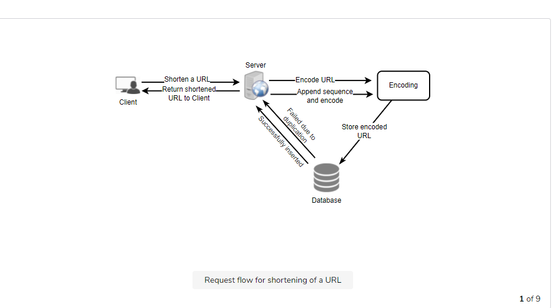
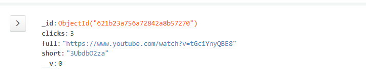

## URL shortner  project built using node js ,expressjs and mongodb
* using ejs templating to directly render the data at client side
## Assumption
* Assuming that  million of url needed to shrink in month , storing the url in such way that  the collisiom chance  reduce to zero .
## Archecture diagram 

# mongodb database schema
# ({
#  full: { type: String, required: true},
#  short: { type: String, required: true},
#  clicks: { type: Number, required: true, default: 0}
# })
#

# using shortid npm package  to give hashed url  the collision probability of any given 2 ids is simply:
# 1 in 38^8
# that's about a 1 in 4 trillion chance, which enough for storing billions of url.

# Two api is created 
# one for creating shorturl and storing it

# one for giving original url and record the number of clicks

# /shortUrls( original_url)
# Parameters:
# original_url (string): Original URL to be shortened.
# Returns: (string)
# A successful insertion returns the shortened URL; otherwise, it returns an error code

# /:shortUrl( shorted_url)
# Parameters:
#  shorted_url (string): shorted url.
# Returns: (string)
# A successful call returns the Original URL and store clicks otherwise, it returns an error code(not found)
